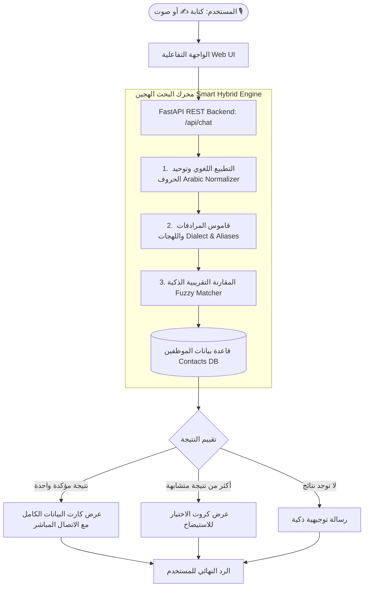

# 🌟 دليل تقديم وعرض مشروع المساعد الذكي لدليل الموظفين
### (Executive Presentation & Technical Defense Guide)

هذا الملف مخصص لك ليكون دليلك الشامل وسلاحك القوي أثناء عرض المشروع على الإدارة أو أصحاب المصلحة (Stakeholders) غداً.

---

## 1. الفكرة والهدف الاستراتيجي (The Value Proposition)

> **المشكلة:** 
> في الشركات الكبيرة، كبار المسؤولين (VIPs / Executives) يضيعون وقتاً ثميناً في البحث عن أرقام وتحويلات ومكاتب الموظفين في ملفات Excel ضخمة أو برامج معقدة، وغالباً ما يتذكر المسؤول معلومة ناقصة فقط (مثل: "عايز يوسف اللي في السوفت وير" أو "مين ماسك الحسابات؟").

> **الحل:**
> مساعد ذكي ثنائي اللغة (عربي / إنجليزي) فائق السرعة، يفهم الاستعلامات الصوتية والنصية باللغة الطبيعية واللهجة العامية، ويستخرج كارت الموظف الكامل في أجزاء من الثانية مع إمكانية الاتصال أو المراسلة بضغطة زر واحدة.

---

## 2. المعمارية الفنية وكيف يعمل النظام (System Architecture)



---

## 3. سيناريوهات العرض العملي الحي (Live Demo Script)

أثناء العرض التوضيحي، جرّب هذه الأسئلة بالترتيب لإبهار الحضور بمرونة الذكاء الاصطناعي:

| # | السؤال المقترح للتجربة | الهدف من التجربة | النتيجة المتوقعة في السيستم |
|---|---|---|---|
| **1** | *"عايز يوسف اللي في السوفت وير"* | **تعدد النتائج والاستيضاح (Disambiguation)** | يعرض كارتين (يوسف أحمد Backend ويوسف علي Frontend) ويطلب من المستخدم تحديد الشخص. |
| **2** | *"احمد يحيا"* | **التسامح مع الأخطاء الإملائية (Typo Tolerance)** | يعثر فوراً على "أحمد يحيى" رغم اختلاف كتابة الألف والياء. |
| **3** | *"مين ماسك الحسابات والمالية؟"* | **البحث بالقسم والتخصص (Role/Dept Search)** | يعرض أحمد سمير ومحمود عزت المسؤولين عن الإدارة المالية. |
| **4** | *"Who is the DevOps engineer?"* | **دعم كامل للغة الإنجليزية (Bilingual)** | يعرض كارت "Ahmed Tarek" بالإنجليزي مباشرة. |
| **5** | *"مين في مبنى A الدور التاني؟"* | **البحث بالموقع والمكتب (Office Location)** | يعرض قائمة الموظفين المتواجدين في الدور الثاني بمبنى A. |
| **6** | *(الضغط على علامة المايك 🎙️ والتحدث بالصوت)* | **البحث الصوتي الذكي (Voice Input)** | يتحول الصوت لنص في الحال ويبحث ويطلع النتيجة. |

---

## 4. الأسئلة التقنية المتوقعة وكيفية الرد عليها (Q&A Defense)

### س1: هل النظام مكلف أو يتطلب اشتراكات شهرية باهظة؟
* **الإجابة النموذجية:** 
  > *"النظام مصمم بمعمارية هجينة موفرة للغاية. حالياً يعمل بمحرك محلي وموديل مجاني 100% (1,500 استعلام يومياً مجاناً). وفي بيئة الإنتاج للشركة بأكملها، تكلفة الألف عملية بحث لا تتجاوز بضعة ملاليم (أقل من 5 دولارات شهرياً لآلاف الموظفين)."*

---

### س2: ماذا لو انقطع الإنترنت عن الشركة أو حدث عطل في خوادم الذكاء الاصطناعي الخارجية؟
* **الإجابة النموذجية:**
  > *"النظام مزود بخاصية **Zero-Downtime Local Fallback**. محرك البحث التقريبي والتطبيع اللغوي يعمل محلياً بالكامل داخل خادم الشركة (On-Premise)، مما يعني أن النظام سيظل يعمل ويبحث ويستخرج بيانات الموظفين حتى في وضع عدم الاتصال بالإنترنت (Offline Mode)."*

---

### س3: كيف نربط هذا النظام مع تطبيق الموبايل الخاص بالشركة أو بوابة الموظفين الحالية (Portal)؟
* **الإجابة النموذجية:**
  > *"قمنا ببناء الباك إند باستخدام معيار **FastAPI REST API** عالمي وموثق بالكامل عبر Swagger (`/docs`). يستطيع فريق الفرونت إند أو مطورو الموبايل ربط الشات بالكامل عبر استدعاء Endpoint واحد فقط (`POST /api/chat`) في أقل من 15 دقيقة."*

---

### س4: هل بيانات الموظفين (أرقام الهواتف والإيميلات) آمنة ومحمية من التسريب؟
* **الإجابة النموذجية:**
  > *"نعم 100%. قاعدة البيانات مستضافة محلياً ومفصولة تماماً، ولا يتم إرسال سوى نية البحث للنموذج، أو تشغيل المعالجة بالكامل محلياً بدون إرسال أي بيانات حساسة خارج شبكة الشركة."*

---

## 5. طريقة تشغيل المشروع وعرضه

1. افتح التيرمينال داخل مجلد المشروع:
   ```bash
   python run.py
   ```
2. افتح المتصفح على الرابط:
   ```
   http://localhost:8000
   ```
3. ابدأ التجربة والشات واستمتع بالعرض! 🚀
